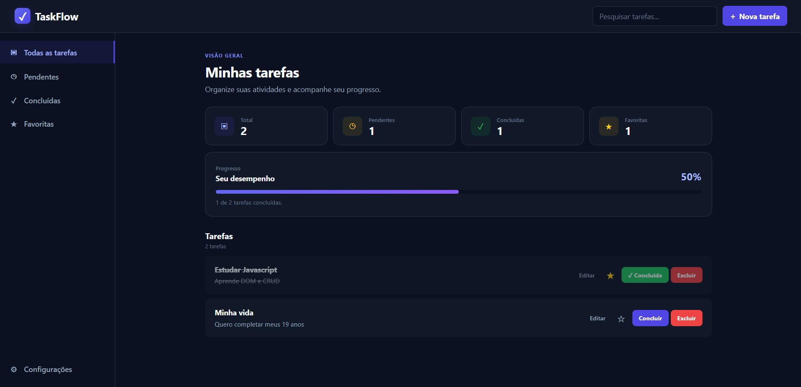

# TaskFlow

> Um gerenciador de tarefas moderno desenvolvido com HTML, CSS e JavaScript puro.

O **TaskFlow** é uma aplicação web criada para praticar e consolidar conceitos fundamentais de desenvolvimento Front-End e JavaScript.

A aplicação permite criar, editar, concluir, excluir e favoritar tarefas, além de oferecer filtros, pesquisa, armazenamento local e acompanhamento do progresso.

🔗 **Site no ar:** ( https://task-flow-six-topaz.vercel.app )

---

## 📚 Aprendizado

Este projeto foi desenvolvido como parte do meu processo de aprendizado em JavaScript.

Durante o desenvolvimento, utilizei o **ChatGPT como ferramenta de apoio**, buscando explicações, exemplos, auxílio na identificação de erros e orientação durante a construção das funcionalidades.

O objetivo foi entender e praticar os conceitos, implementando e testando cada etapa do projeto.

---

## 🖥️ Preview



> Screenshot da aplicação.

---

## ✨ Funcionalidades

- [x] Criar tarefas
- [x] Editar tarefas
- [x] Excluir tarefas
- [x] Concluir e reabrir tarefas
- [x] Favoritar tarefas
- [x] Filtrar tarefas
- [x] Pesquisar tarefas
- [x] Persistência com LocalStorage
- [x] Dashboard com estatísticas
- [x] Barra de progresso
- [x] Feedback visual através de Toasts
- [x] Modal de confirmação para exclusão
- [x] Estado vazio para listas sem tarefas
- [x] Interface responsiva
- [x] Animações e microinterações

---

## 🚀 Tecnologias utilizadas

### Front-End

- HTML5
- CSS3
- JavaScript
- LocalStorage
- CSS Flexbox
- CSS Grid
- Responsive Design

### Ferramentas

- Visual Studio Code
- Git
- GitHub
- GitHub Desktop
- DevTools

---

## 📂 Estrutura do projeto

```text
TaskFlow/
│
├── index.html
├── README.md
│
└── assets/
    │
    ├── css/
    │   ├── reset.css
    │   ├── variables.css
    │   ├── main.css
    │   └── style.css
    │
    └── js/
        └── app.js
